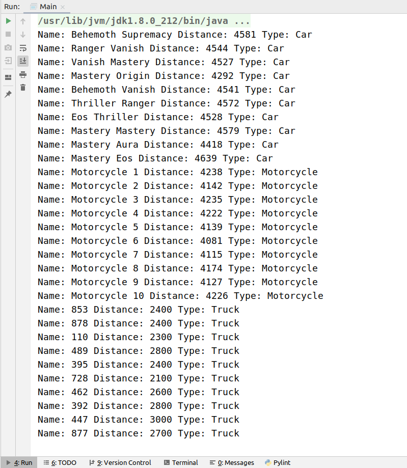

# Car race Simulator

50 hours race simulation of 10 cars, 10 trucks, 10 motorcycles. It's an exercise to practice four Object Oriented Programming principles like encapsulation, abstraction, inheritance and polymorphism. 

## Results

